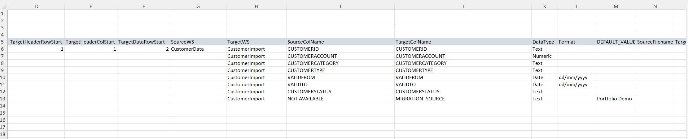
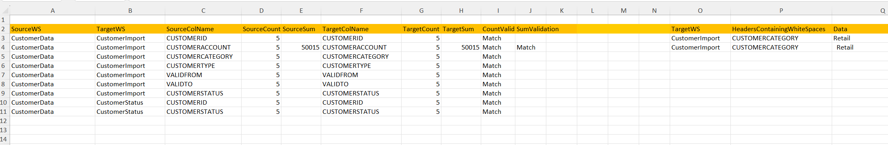
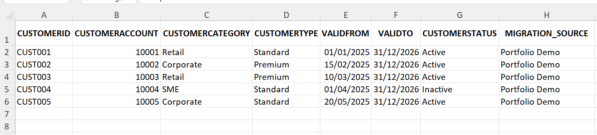

# Excel VBA Dynamic Data Migration & Reconciliation Tool

A configuration-driven Excel VBA solution for migrating data from source datasets into structured target templates.

The tool uses dynamic source-to-target column mappings, configurable data types and formats, automated default values, reconciliation checks, and whitespace validation to provide a controlled and repeatable data migration process.

## Key Features

- Dynamic source-to-target column mapping
- Single source worksheet to multiple target worksheet migration
- Configuration-driven migration with no VBA changes required for new mappings
- Supports TEXT, NUMERIC and DATE data types
- Configurable date and numeric formatting
- Automatic population of target-only fields using default values
- Source vs target record-count reconciliation
- Numeric source vs target sum reconciliation
- Automatic Match / No Match validation
- Detection and cleansing of leading, trailing and duplicate spaces
- Missing source and target column reporting
- Timestamped migrated output files
- Direct link to the latest generated migration file
- Modular VBA architecture for easier maintenance

## How It Works

The migration process is controlled through the Excel `Control` worksheet rather than hard-coded source-to-target mappings.

1. Configure the source and target worksheet structure in the Control sheet.
2. Define the source-to-target column mappings.
3. Specify data types, formats and optional default values.
4. Click **Run Migration** from the Frontpage.
5. Select the source dataset and target template.
6. VBA dynamically reads the configuration and migrates the required data.
7. A single source worksheet can populate multiple worksheets within the target workbook.
8. The tool performs automated count and numeric sum reconciliation.
9. Whitespace issues are detected, reported and cleansed.
10. A timestamped migrated workbook is generated and linked from the Frontpage.

The original target workbook acts as the import template, while the populated migration output is saved as a new timestamped file.

## VBA Architecture

The solution is split into five VBA modules, separating the migration, validation and data-quality logic.

| Module | Purpose |
|---|---|
| `MIGRATION.bas` | Main migration engine. Reads configuration, performs dynamic mappings, handles formatting and generates the migrated output. |
| `HELPER.bas` | Reusable helper functions for configuration lookup, file selection, column matching and worksheet processing. |
| `AUDIT.bas` | Records source and target counts, numeric totals and reconciliation results on the Validation sheet. |
| `DEFAULT_VALUE.bas` | Populates target fields with configured default values when no corresponding source column is available. |
| `SPACES.bas` | Detects, reports and cleans leading, trailing and duplicate whitespace in migrated data. |

This modular structure keeps the core migration process separate from supporting validation and data-quality functions, making the solution easier to maintain and extend.

## Demo Files

The repository includes fictional demo files so the migration process can be tested without using any client or commercially sensitive data.

### Source
`Demo_Files/Demo_Source_CustomerData.xlsx`

Contains a fictional customer dataset used as the migration source.

### Target Template
`Demo_Files/Demo_Target_CustomerImport.xlsx`

Contains the target import structure used by the migration process. The demo also includes multiple target worksheets to demonstrate that a single source worksheet can populate more than one target worksheet.

### Portfolio Workbook
`Data_Migration_Portfolio.xlsm`

Contains the Frontpage, Control configuration, Validation reporting and VBA automation.

The demo configuration demonstrates:

- Dynamic source-to-target mappings
- One source worksheet populating multiple target worksheets
- TEXT, NUMERIC and DATE handling
- Target-only fields populated using default values
- Record-count reconciliation
- Numeric sum reconciliation
- Missing-column reporting
- Whitespace detection and cleansing
- Timestamped migration output

## Screenshots

### Frontpage
Run the migration directly from the Excel interface.

### Configuration-Driven Mapping
Source-to-target mappings, data types, formats and default values are maintained through the Control worksheet.

### Automated Validation & Reconciliation
The Validation worksheet compares source and target record counts and numeric totals, providing clear Match / No Match results.

### Migrated Output
The populated target workbook is generated as a new timestamped file, including fields automatically populated using configured default values.

## How to Run

1. Download or clone this repository.
2. Open `Data_Migration_Portfolio.xlsm` in Microsoft Excel.
3. Enable macros when prompted.
4. Review the mappings on the `Control` worksheet.
5. Click **Run Migration** on the Frontpage.
6. When prompted, select:
   - `Demo_Files/Demo_Source_CustomerData.xlsx` as the source file.
   - `Demo_Files/Demo_Target_CustomerImport.xlsx` as the target template.
7. Wait for the migration to complete.
8. Review the `Validation` worksheet for reconciliation results.
9. Click **Open Latest File** on the Frontpage to open the generated migrated workbook.

> **Note:** If the demo files are stored in OneDrive, ensure AutoSave is disabled for the target template before running the migration. This prevents Excel/OneDrive from automatically saving migrated data back into the original template while it is open.

The migration output is created as a new timestamped `.xlsx` file, leaving the target template available for reuse.

## Technical Highlights

This project demonstrates practical Excel VBA engineering for data migration and ETL-style processing, including:

- Configuration-driven processing rather than hard-coded column mappings
- Dynamic worksheet and column discovery
- Single-source to multi-target worksheet migration
- Source-to-target data transformation
- Reusable helper functions
- Dynamic row-count calculation
- Target-only field generation using configurable default values
- Data-type-aware formatting for TEXT, NUMERIC and DATE fields
- Record-count reconciliation
- Numeric control-total reconciliation
- Automated exception and missing-column logging
- Whitespace detection and cleansing
- Timestamped output generation
- Modular separation of migration, audit, default-value and data-quality logic

The approach allows mappings and migration rules to be changed through the Excel Control worksheet without modifying the underlying VBA code.
